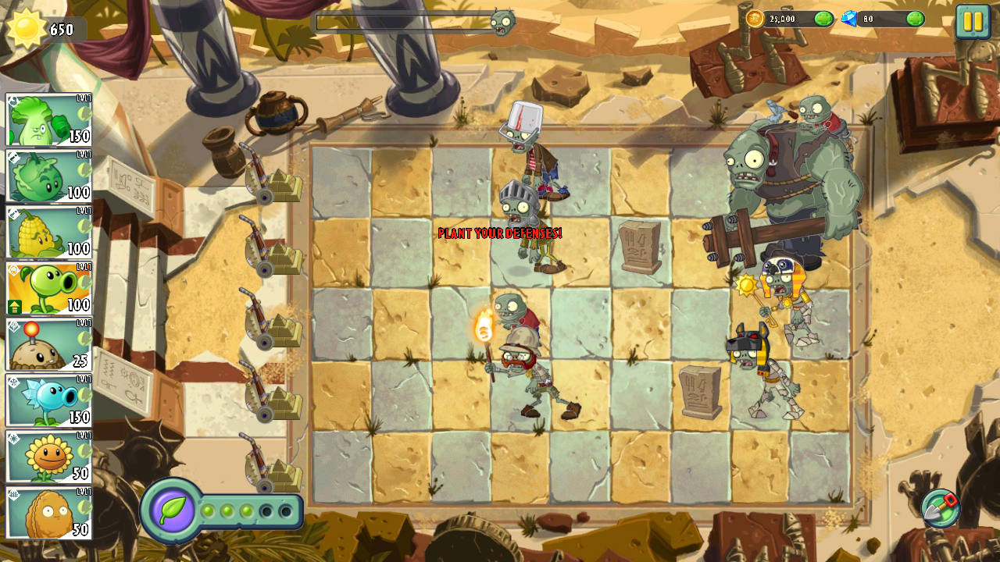
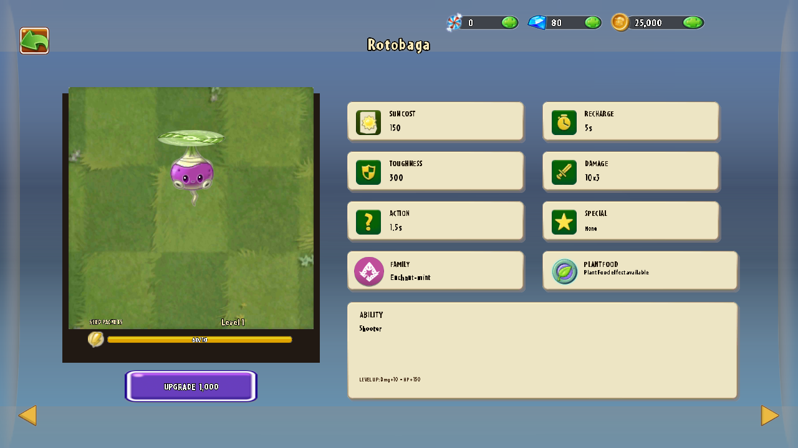
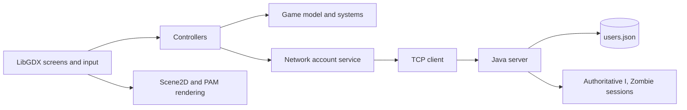

# Plants vs. Zombies 2 — Java/LibGDX Recreation


An educational, team-built recreation of **Plants vs. Zombies 2**, developed in Java with LibGDX. The project combines a data-driven plant and zombie model, animated gameplay, multiple worlds and minigames, persistent player accounts, a server-backed leaderboard, and a networked two-player **I, Zombie** mode.

> This is an unofficial academic project. Plants vs. Zombies and its original characters, artwork, and audio belong to PopCap Games and Electronic Arts. The project is not affiliated with or endorsed by them.

## Screenshots

| Gameplay | Plant collection |
| --- | --- |
|  |  |

## Highlights

- Animated plants, zombies, projectiles, status effects, Plant Food, lawn mowers, waves, rewards, cooldowns, and sun collection.
- Data-driven plant and zombie definitions loaded from bundled CSV and JSON resources.
- Four adventure worlds with world-specific terrain and gameplay behavior: Ancient Egypt, Ice Caves, Big Wave Beach, and Medieval.
- Plant collection, upgrades, plant selection, quests, shop, greenhouse, travel log, news, profile, and leaderboard screens.
- Multiple minigames, including Vasebreaker, Beghouled, Wall-nut Bowling, Zombotany, and I, Zombie.
- Client–server account system with authentication, persistent profiles, password recovery, and server-side leaderboard ranking.
- Networked I, Zombie matchmaking with direct invitations, random matchmaking, authoritative server simulation, synchronized entities, and reactions.
- Layered LibGDX/Scene2D rendering with PAM animation and texture-atlas support.

## Architecture

The project is organized as a Gradle multi-module application:

```text
src/untitled/
├── shared/   # JSON request/response contracts shared by client and server
├── client/   # TCP client transport
├── server/   # account, persistence, leaderboard, and multiplayer server
├── core/     # game model, controllers, screens, rendering, and minigames
├── lwjgl3/   # desktop launcher
└── assets/   # bundled game data, textures, animations, fonts, and audio
```



The regular game model advances through a tick-based engine. In networked I, Zombie matches, the server owns the match state and broadcasts snapshots containing time, resources, plants, zombies, projectiles, and brain state to both clients.

## Tech Stack

- Java 21
- LibGDX 1.14.2 and LWJGL3
- Gradle Wrapper with separate `core`, `shared`, `client`, `server`, and `lwjgl3` modules
- Gson for JSON serialization
- TCP sockets with a request/response protocol
- JUnit 4 integration tests
- [libPVZ](https://github.com/pizpizi/libPVZ) and [pvz-skin](https://github.com/pizpizi/pvz-skin) for working with PVZ animation and UI resources
- TenPatch for scalable UI elements

## Running Locally

### Requirements

- Java Development Kit 21
- Git
- An internet connection on the first build so Gradle can resolve dependencies

Clone the repository and enter the Gradle project:

```bash
git clone https://github.com/advanced-progamming-sut-2026/phase-0-last-dinner.git
cd phase-0-last-dinner/src/untitled
```

The account, leaderboard, and online minigame features require the server. Start it before launching the game.

### Windows PowerShell

Terminal 1 — server:

```powershell
.\gradlew.bat server:run
```

Terminal 2 — desktop client:

```powershell
$env:PVZ_SERVER_HOST="127.0.0.1"
$env:PVZ_SERVER_PORT="8082"
.\gradlew.bat lwjgl3:run
```

### Git Bash, Linux, or macOS

Terminal 1 — server:

```bash
./gradlew server:run
```

Terminal 2 — desktop client:

```bash
export PVZ_SERVER_HOST="127.0.0.1"
export PVZ_SERVER_PORT="8082"
./gradlew lwjgl3:run
```

To connect from another computer on the same network, bind the server to all interfaces and point each client to the server machine's IPv4 address:

```bash
# Server machine
export PVZ_SERVER_BIND_HOST="0.0.0.0"
export PVZ_SERVER_PORT="8082"
./gradlew server:run

# Client machine
export PVZ_SERVER_HOST="192.168.x.x"
export PVZ_SERVER_PORT="8082"
./gradlew lwjgl3:run
```

The host firewall must allow inbound TCP traffic on port `8082`.

## Tests

From `src/untitled`:

```bash
./gradlew test
```

The server test suite includes account persistence, authentication, profile updates, remembered sessions, leaderboard behavior, and unavailable-server handling.

## Team

**Team Last Supper**

| Member | Primary areas |
| --- | --- |
| Matin Khorasani | Core game systems, progression, levels, quests, shop, greenhouse, and selected gameplay/UI features |
| Sepanta Saeidi | Minigames, authentication/profile UI, leaderboard UI, and the I, Zombie multiplayer foundation and gameplay |
| [Shayan Pourghafar](https://github.com/shayanp85) | Plant and zombie systems, collection and plant-pick flows, gameplay rendering and interactions, account/network integration, and leaderboard networking |

Development was collaborative, and responsibilities overlapped through integration, reviews, merges, and shared bug fixes.

## Project Context

This repository was created for the Advanced Programming course at Sharif University of Technology in 2026. The implementation evolved across three project phases, from the domain model and gameplay systems to the graphical client and client–server networking.

## Resource Credits

- Original Plants vs. Zombies 2 concept and intellectual property: PopCap Games / Electronic Arts
- Course-provided visual and audio resources
- [pvz-skin](https://github.com/pizpizi/pvz-skin)
- [libPVZ](https://github.com/pizpizi/libPVZ)
- [PVZ Asset Browser](https://github.com/pizpizi/pvz-asset-browser)

No standalone license is declared for third-party game assets contained in this academic repository.
